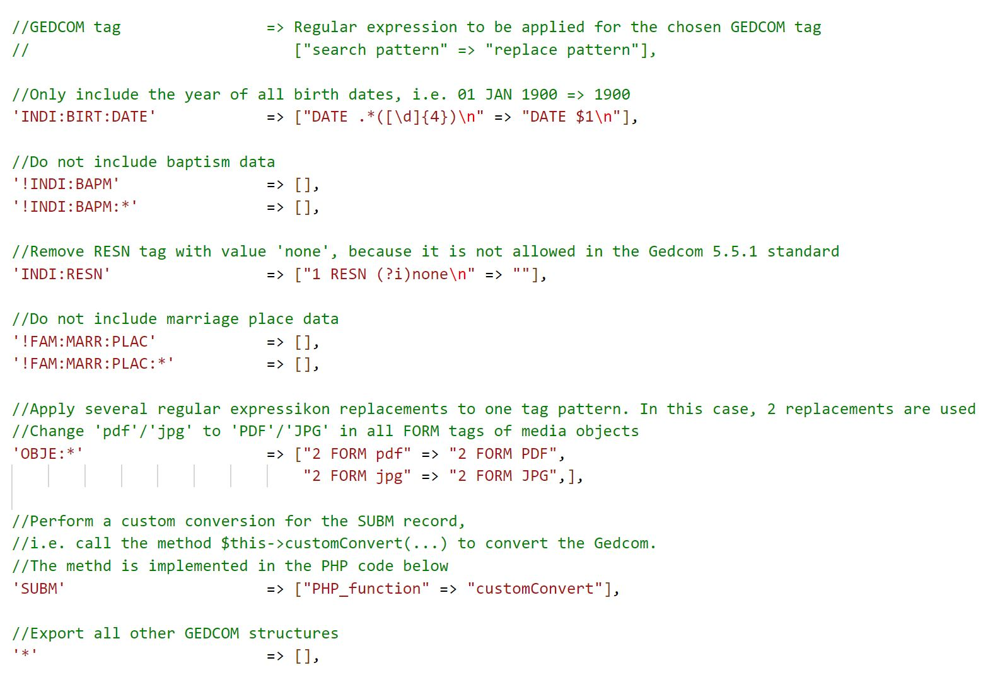
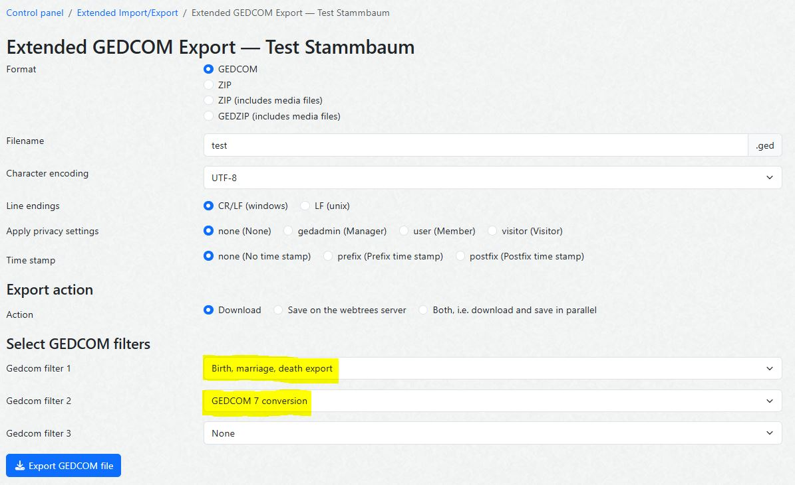
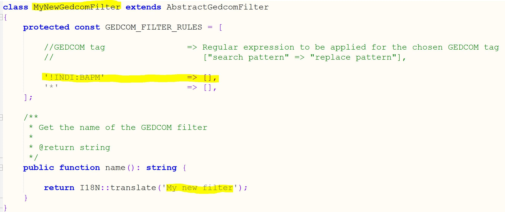
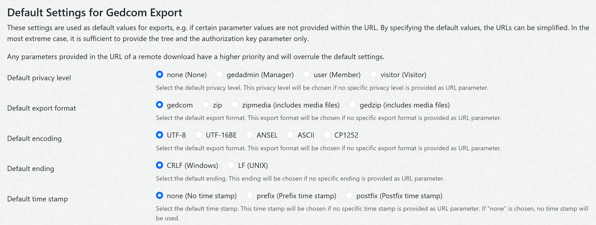

# Extended Import/Export
### (Earlier name: Extended Import/Export Overview)
A [webtrees](https://webtrees.net) 2.1 custom module for **advanced GEDCOM import, export and filter operations**. The module also supports **remote downloads/uploads via URL requests**.

The module provides a framework for **customizable GEDCOM filters**, which allow to modify the GEDCOM data during an import/export. A set of pre-configured GECCOM filters is provided and supports GEDCOM 7 conversion as well as a variety of other GEDCOM filtering operations. The GEDCOM filters can be triggered remotely as well as by the user in specific import/export/conversion/datafix views.

##  Table of contents
This README file contains the following main sections:
+   [Overview](#extended-importexport-overview)
+   [What are the benefits of this module?](#what-are-the-benefits-of-this-module)
+   [IMPORTANT SECURITY NOTES](#important-security-notes)
+   [Screenshot](#screenshot)
+   [Installation](#installation)
+   [Webtrees Version](#webtrees-version)
+   [GEDCOM filters](#gedcom-filters)
    +   [Concept](#concept)
    +   [Example filters](#example-filters)
    +   [List of included GEDCOM filters](#list-of-included-gedcom-filters)
    +   [How to use GEDCOM filters](#how-to-use-gedcom-filters)
    +   [How to add additional GEDCOM filters](#how-to-add-additional-gedcom-filters)
        + [A first example filter](#a-first-example-filter)
        + [Regular Expression Macros](#regular-expression-macros)
        + [PHP function customConvert](#php-function-customconvert)
        + [Additional switches](#additional-switches)
    +   [Details about GEDCOM Filter Execution](#details-about-gedcom-filter-execution)
    +   [GEDCOM Filter Validation](#gedcom-filter-validation)
+   [Remote API](#remote-api)
    + [URL Format for Remote Requests](#url-format-for-remote-requests)
    + [Example URLs for Remote Requests](#example-urls-for-remote-requests)
    + [Values for URL Parameters](#values-for-url-parameters)
+   [Folder for Files to Import/Export/Convert](#folder-for-files-to-importexportconvert)
+   [Authorization Key Settings](#authorization-key-settings)
+   [Default Values in the Module Settings (Control Panel)](#default-values-in-the-module-settings-control-panel))
+   [Recommended Steps to Test the Module](#recommended-steps-to-test-the-module)
+   [GEDCOM 7 Conversion](#gedcom-7-conversion)
+   [Translation](#translation)
+   [Bugs and Feature Requests](#bugs-and-feature-requests)
+   [Github Repository](#github-repository)

## What are the benefits of this module?
+ Applying GEDCOM filters during import/export
    + Download/upload/convert GEDCOM files in the GEDCOM 7 format
    + Improve the GEDCOM export before downloading, e.g. avoid leading spaces in CONT structures, remove non-standard RESN, remove CHAN data, ...
    + Remove empty and unlinked records, which result from privacy settings in webtrees
    + Create your own customizable GEDCOM filter
    + Run a sequence of GEDCOM filters or combine several filters
    + Convert GEDCOM files with GEDCOM filters
+ Remote download/upload/save
    + Remotely download/upload GEDCOM files without logging into the user interface (webtrees front end)
    + Download/Upload GEDCOM files with a script, see attached [example scripts](#example-scripts)
    + Remotely trigger to save GEDCOM files to a folder on the webtrees server without logging into the user interface (webtrees front end)
    + Schedule regular GEDCOM file backups on the server with a Cron Job, see attached [example script](#example-scripts)
    + Apply GEDCOM filters during remote download/upload

## IMPORTANT SECURITY NOTES
**Module versions starting from v3.0.0 use an authorization key**, which is stored in the module preferences in webtrees. Access to the download is only allowed if the provided key in the URL is identical to a authorization key in the webtrees database (settings).

**Please note that everyone with access to the authorization key, can download/upload GEDCOM files from/to your webtrees installation.**

**It is highly recommended to use the HTTPS protocol** (i.e. URLs with https://...) in order to encrypt the URL parameters, especially the authorization key.

Please note that the earlier **versions v1.0.0 and v2.0.0 did NOT use an authorization key**. This means that installing these module versions enables everyone, who can reach the webtrees URL, to download GEDCOM files from webtrees. **Therefore, it is highly recommended to uprade to a module version v3.0.0 or later**.

##  Screenshot

## Installation
+ Download the [latest release](https://github.com/Jefferson49/DownloadGedcomWithURL/releases/latest) of the module
+ Copy the folder "download_gedcom_with_url" into the "module_v4" folder of your webtrees installation
+ Check if the module is activated in the control panel:
  + Login to webtrees as an administrator
	+ Go to "Control Panel/All Modules", and find the module called "DownloadGedcomWithURL"
	+ Check if it has a tick for "Enabled"
+ If remote download/upload/saving of GEDCOM files shall be used, activate the related options in the control panel, see chapter below.
+ If remote options are activated, provide an authorization key in the module settings, see chapter below.
+ Optionally, specify default settings in the control panel, which might reduce the number of parameters to be provided within the URL.

## Webtrees Version
The module was developed and tested with [webtrees 2.1.20](https://webtrees.net/download), but should also run with any other 2.1 version.

## GEDCOM filters

### Concept

The principle concept of GEDCOM filters is shown in the screenshot below. A GEDCOM filter contains of several filter rules, which are defined as follows:
1. GEDCOM tag combinations can be selected to be included to the GEDCOM export
2. A replacement rule can be applied to the selected tag combination by using a search/replace pattern with [regular expressions](https://en.wikipedia.org/wiki/Regular_expression).

Further details about filter rules are shown in the following screenshot:
+ Un-Selecting tag combinations: This will remove the related GEDCOM structures from the export.
+ Applying several search/replace patterns to a single tag combination
+ Apply no replacement/conversion. In this case, the existing GEDCOM string of the tag combination will be included in the export.
+ Using placeholders (i.e. asterisk, '*') for tags in tag combinations
+ Using overall placeholder '*' to select any tag combination, i.e. all GEDCOM structures
+ Perform a custom conversion of a GEDCOM structure by calling the PHP method $this->customConvert(...), which can be added to the filter code.

### Example filters
Further insights about GEDCOM filters can be gained by refering to the following GEDCOM filters:
+ **Example GEDCOM filter** ([ExampleGedcomFilter.php](https://github.com/Jefferson49/DownloadGedcomWithURL/blob/main/resources/filter/ExampleGedcomFilter.php)): This filter contains some examples for filter rules with tag combinations and regular expressions for GEDCOM conversion.
+ **Birth, marriage, death export** ([BirthMarriageDeathGedcomFilter.php](https://github.com/Jefferson49/DownloadGedcomWithURL/blob/main/resources/filter/BirthMarriageDeathGedcomFilter.php)): This filter contains a typical filter example. The filter includes birth, marriage, and death data only. The generated GEDCOM also contains links to the related individuals and families in webtrees.
+ **Combined export filter** ([CombinedGedcomFilter.php](https://github.com/Jefferson49/DownloadGedcomWithURL/blob/main/resources/filter/CombinedGedcomFilter.php)): Shows how several filters can be combined to a single filter, which executes a sequence of the combined filters.

### List of included GEDCOM filters
|Filter Name|Description|
|:----------|:----------|
|[All records](https://github.com/Jefferson49/DownloadGedcomWithURL/blob/main/resources/filter/AllRecordsGedcomFilter.php)|A template, which exports all records, as a starting point to create your own GEDCOM filter|
|Avoid leading spaces for CONC|Modifies CONC structure in order to avoids leading spaces|
|Birth, marriage, death export|Exports INDI and FAM data and only include limited facts about birth marriage, and death|
|Combined GEDCOM filter|An example how several filters can be combined to a filter, which executes a sequence of filters|
|Example GEDCOM filter|An example filter, which demonstrates the principle features of GEDCOM filters|
|GEDCOM 7 conversion|A filter, which converts the GEDCOM export to the GEDCOM 7 standard|
|Individual names CSV list|An example, how GEDCOM filters can be used to generate alternative formats, e.g. CSV, JSON, etc.|
|No records|A template, which only exports HEAD/SUBM/TRLR, as a starting point to create your own GEDCOM filter|
|Optimization of webtrees export for GEDCOM 7|A GEDCOM filter, which changes some of the webtrees GEDCOM structures in order to improve complicance to the GEDCOM 7.0 standard|
|Optimization of webtrees export for GEDCOM 5.5.1|A GEDCOM filter, which changes some of the webtrees GEDCOM structures in order to improve complicance to the GEDCOM 5.5.1 standard|
|Reduce dates to years|A GEDCOM filter, which reduces all dates to years only|
|Remove minimal individuals|A GEDCOM filter, which identifys individuals with SEX/FAMC/FAMS or less and removes their data|
|Remove asterisk characters from names|A GEDCOM filter, which removes asterisk characters (i.e. '*') from names. Background: In webtrees, an asterisk character indicates the part of a given name to be underlined.|
|Remove change data (i.e. CHAN structures)|A GEDCOM filter, which removes CHAN structures|
|Remove empty or unlinked records|A GEDCOM filter to remove empty and unlinked records (FAM, NOTE, OBJE, REPO, SOUR, _LOC)|
|Remove restrictions (i.e. RESN tags)|A GEDCOM filter, which removes RESN structures|
|Remove ToDo data (i.e. _TODO structures)|A GEDCOM filter, which removes _TODO structures|
|Remove webtrees user data (i.e. _WT_USER tags)|A GEDCOM filter, which removes webtrees user structures (_WT_USER)|

### How to use GEDCOM filters

In the module settings (control panel), four different views are offered to use the GEDCOM filter:
  

In the corresponding views (e.g. GEDCOM Export), the GEDCOM filters can be selected and applied:
  

  
Additionally, GEDCOM filter can be applied via the [Remote API](#remote-api), which is described in a separate section.

### How to add additional GEDCOM filters

#### A first example filter
To create a first example for a simple GEDCOM filter, the following steps can be taken:
+ Navigate to the filter directory in your webtrees installation: **\modules_v4\download_gedcom_with_url\resources\filter**
+ Copy the existing filter **AllRecordsGedcomFilter.php** filter to a new file, e.g. MyNewGedcomFilter.php in the same directory
+ Open the newly created .php file and substitue "class **AllRecordsGedcomFilter**" by a new class name, e.g. "class MyNewGedcomFilter"
+ Substitute the filter name in "I18N::translate('**All records**')" by a new filter name, e.g. 'My new filter'"
+ Add new filter rules after **//Export all**, e.g. '!INDI:BAPM' => []

#### Regular Expression Macros
If the same regular expression replacement shall be used in several filter rules, a macro can be defined, which allows to define a regular expression replacement once and use it several times. 

Macros can be defined within the "const **REGEXP_MACROS**" structure:
  

In filter rules, the macro name can be used instead of regular expression replacements:
+ Use "RegExp_macro" as "search pattern"
+ Use the macro name as "replace pattern"
  

#### PHP function customConvert
The general idea of the GEDCOM filter is to apply regular expression replacements. However, for certain purposes, regular expression replacements are not powerful enough to provide the necessary functionality. In these cases, a PHP function can be called, which allows to make use of the full PHP programming language functionality.

In order to use the PHP function call, a customConvert function needs to be inserted to the code of the GEDCOM filter class. The interface of the customConvert function is defined in the [GedcomFilterInterface](https://github.com/Jefferson49/DownloadGedcomWithURL/blob/main/GedcomFilterInterface.php#L53).

In filter rules, the PHP customConvert function can be used instead of regular expression replacements:
+ Use "PHP_function" as "search pattern"
+ Use "customConvert" as "replace pattern"

#### Additional switches
Additional switched can be used for some specific purposes:
+   USES_REFERENCES_ANALYSIS (default: false) 
    + If set to true, the filter will execute an analysis of references in the GEDCOM structures, which will identify empty records and records without references. The result of this analysis can be used by GEDCOM filters. An example can be found in the removeEmptyOrUnlinkedRecords function of the[RemoveEmptyOrUnlinkedRecordsGedcomFilter](https://github.com/Jefferson49/DownloadGedcomWithURL/blob/main/resources/filter/RemoveEmptyOrUnlinkedRecordsGedcomFilter.php#L97). 
+   USES_SCHEMA_TAG_ANALYSIS (default: true)
    + If set to true, a SCHMA structure for known custom tags will be included if GEDCOM 7 is detected in the header.
+   WRAP_LINES_WITHOUT_LEADING_AND_TRAILING_SPACES (default: false)
    + If set to true, leading spaces for CONC structures are avoided.

### Details about GEDCOM Filter Execution
+ The initial GEDCOM structure is parsed for GEDCOM records.
+ The hierarchical structure of the GEDCOM record is analyzed, e.g.
    + INDI
        + NAME
        + BIRT
            + DATE
        + DEAT
            + DATE        
+ **Inner** GEDCOM structures are filtered **before outer** structures.
    + In the example above, the order of the executed filter rules will be: "INDI:BIRT:DATE" before "INDI:BIRT", and finally "INDI".
+ Replacements of filter rules will always be applyed to the full GEDCOM structure below, i.e. a filter rule replacement for "INDI" will also affect the data in "INDI:BIRT".
+ For each part of the identifyed GEDCOM structure, the corresponding GEDCOM tag combination (e.g. INDI:BIRT:DATE) is determined.
+ The GEDCOM filter is searched for a filter rule, which matches with the identifyed tag combination.
+ The first matched filter rule is executed.
+ After one filter rule has been matched, the filter execution is terminated. Further filter rules, which might also match will NOT be executed.

### GEDCOM Filter Validation
The class [AbstractGedcomFilter](https://github.com/Jefferson49/DownloadGedcomWithURL/blob/main/AbstractGedcomFilter.php#L128) contains a set of validation rules for GEDCOM filters. Everytime a GEDCOM filter is selected in the control panel or before a filter execution, the validation routines are run. 

The validation includes the following checks:
+ Validate the structure and content of the filter rules (in EXPORT_FILTER)
+ Validate the structure and content of regular expression macros (in REGEXP_MACROS)
+ Validate the tag definitions of the filter rules
+ Check if a filter rule is dominated by another rule, which is of higher priority (i.e. earlier entry in the GEDCOM filter list)
+ Validate the regular expressions of the filter rules, whether they contain valid regular expression definitions
+ Validate whether the customConvert method is available in the PHP code if customConvert is used in the filter rules
+ Validate whether regular expression macros are available if used in the filter rules
+ Check if black list filter rules have regular expressions and create a warning that they are never executed
+ Validate, whether the getGedcomFilterRules() method creates a PHP error
+ Validate, whether getIncludedFiltersBefore() and ~After() methods creates a PHP error

There is also a check included, whether GEDCOM filter classes create PHP compilation errors. This check is performed if selecting or executing GEDCOM filters.

## Remote API

### URL Format for Remote Requests
The full URL format, which contains all possible parameters is defined as follows:

**BASE_URL**/index.php?route=/webtrees/**DownloadGedcomWithURL**  
&emsp;**&action**=[MY_ACTION](#MY_ACTION)  
&emsp;**&tree**=[MY_TREE](#MY_TREE)  
&emsp;**&key**=[MY_KEY](#MY_KEY)  
&emsp;**&file**=[MY_FILENAME](#MY_FILENAME)  
&emsp;**&file_converted**=[MY_FILENAME_CONVERTED](#MY_FILENAME_CONVERTED)  
&emsp;**&format**=[MY_EXPORT_FORMAT](#MY_EXPORT_FORMAT)  
&emsp;**&privacy**=[MY_PRIVACY_LEVEL](#MY_PRIVACY_LEVEL)  
&emsp;**&encoding**=[MY_ENCODING](#MY_ENCODING)  
&emsp;**&line_endings**=[MY_ENDINGS](#MY_ENDINGS)  
&emsp;**&time_stamp**=[MY_TIME_STAMP](#MY_TIME_STAMP)  
&emsp;**&gedcom_filter1**=[MY_GEDCOM_FILTER1](#MY_GEDCOM_FILTER)  
&emsp;**&gedcom_filter2**=[MY_GEDCOM_FILTER2](#MY_GEDCOM_FILTER)  
&emsp;**&gedcom_filter3**=[MY_GEDCOM_FILTER3](#MY_GEDCOM_FILTER)  
&emsp;**&import_encoding**=[MY_IMPORT_ENCODING](#MY_IMPORT_ENCODING)  
&emsp;**&keep_media**=[MY_KEEP_MEDIA](#MY_KEEP_MEDIA)  
&emsp;**&word_wrapped_notes**=[MY_WORD_WRAPPED_NOTES](#MY_WORD_WRAPPED_NOTES)  
&emsp;**&gedcom_media_path**=[MY_GEDCOM_MEDIA_PATH](#MY_GEDCOM_MEDIA_PATH)

**BASE_URL** is the webtrees base URL, which is defined in the config.ini.php file, e.g. base_url="https://dev.webtrees.net/demo-stable".

The "MY_XXX" place holders need to be replaced by the specific parameter values, which shall be used for the upload/download/conversion. The possible values for the URL parameters are described below. 

Most of the parameters match 1:1 to the webtrees import/xport settings in the control panel. To gain a better understanding of these parameters, it is very helpful to check these parameters and run some manual tests in the control panel.

It is not mandatory to provide all parameters. The only mandatory parameters are the tree and the authorization key. If any of the other parameters is not provided as URL parameter, the default value, which is specified in the control panel, is used. The tree name is used as default value for the file name. Download is used as default action.

### Example URLs for Remote Requests
BASE_URL/index.php?route=/webtrees/DownloadGedcomWithURL&tree=tree1&key=hYHBiZM9

BASE_URL/index.php?route=/webtrees/DownloadGedcomWithURL&tree=tree1&key=hYHBiZM9file=export

BASE_URL/index.php?route=/webtrees/DownloadGedcomWithURL&action=both&tree=tree1&key=hYHBiZM9&file=export&privacy=user&format=zip&encoding=ANSEL&line_endings=LF&time_stamp=prefix&gedcom_filter1=GEDCOM_7_ExportFilter

### Values for URL Parameters  
* **<a name="MY_ACTION">MY_ACTION</a>** specifies whether the GEDCOM file will be uploaded, converted, downloaded, saved on the server, or both (downloaded and saved)
  * Accepted values: **download** (default), save, both, upload, convert
  * The folder within the webtrees root path to save GEDCOM files can be specified in the module settings in the control panel

* **<a name="MY_TREE">MY_TREE</a>** specifies the webtrees tree name
  * This is a mandatory parameter. If it is not provided in the URL, the remote request will be denied.

* **<a name="MY_KEY">MY_KEY</a>** specifies a authorization key, which restricts the access to the download
  * This is a mandatory parameter. If it is not provided in the URL, the remote request will be denied.

* **<a name="MY_FILENAME">MY_FILENAME</a>** can be provided with or without file extension, i.e. use this_file instead of this_file.ged
  * The tree name (MY_TREE) is taken as default if MY_FILENAME is not provided

* **<a name="MY_FILENAME_CONVERTED">MY_FILENAME_CONVERTED</a>** can be provided with or without file extension. 
  * The file name (before conversion) is taken as default if MY_FILENAME_CONVERTED is not provided

* **<a name="MY_EXPORT_FORMAT">MY_EXPORT_FORMAT</a>** specifies the file format for the export
  * Accepted values: **gedcom** (default), zip, zipmedia, gedzip, other

* **<a name="MY_PRIVACY_LEVEL">MY_PRIVACY_LEVEL</a>** specifies the user role, in which the GEDCOM export is executed
  * Accepted values: **none** (default), gedadmin, user, visitor

* **<a name="MY_ENCODING">MY_ENCODING</a>** specifies the encoding of the generated GEDCOM file
  * Accepted values: **UTF-8** (default), UTF-16BE, ANSEL, ASCII, CP1252

* **<a name="MY_ENDINGS">MY_ENDINGS</a>** specifies the line endings in the generated GEDCOM file
  * Accepted values: **CRLF** (default), LF

* **<a name="MY_TIME_STAMP">MY_TIME_STAMP</a>** specifies whether a (GMT) time stamp will be added to the file name of saved GEDCOM files. MY_TIME_STAMP also defines whether the time stamp is added as prefix or as a postfix.
  * Accepted values: **none** (default), prefix, postfix

* **<a name="MY_GEDCOM_FILTER">MY_GEDCOM_FILTER1/2/3</a>** specifies a GEDCOM filter to be executed during the import/export/conversion.
  * Accepted values: Filter names (without .php extension) of existing GEDCOM filter in the following webtress directory: **modules_v4/download_gedcom_with_url/ressources/filter/**. For example, "GEDCOM_7_GedcomFilter" is chosen for a GEDCOM 7 conversion.

* **<a name="MY_IMPORT_ENCODING">MY_IMPORT_ENCODING</a>** overrides the encoding specified in the header of the GEDCOM import file
  * Accepted values: ASCII, ANSEL, UTF-8, UTF-16BE, ...
  * Further allowed values can be found [in the webtrees EncodingFactory](https://github.com/fisharebest/webtrees/blob/main/app/Factories/EncodingFactory.php#L98)

* **<a name="MY_KEEP_MEDIA">MY_KEEP_MEDIA</a>** specifies whether media shall be kept during import
  * Accepted values: 1 (true), 0 (false)
  * The last import setting of the tree is used as default

* **<a name="MY_WORD_WRAPPED_NOTES">MY_WORD_WRAPPED_NOTES</a>** specified whether to reinsert the missing spaces if spaces are omiited in the import file during splitting of long lines
  * Accepted values: 1 (true), 0 (false)
  * The last import setting of the tree is used as default

* **<a name="MY_GEDCOM_MEDIA_PATH">MY_GEDCOM_MEDIA_PATH</a>** specifies a part of the media file path, which shall be removed from file names during the GEDCOM import
  * Accepted values: A file path used in the GEDCOM import file, e.g. "C:\Documents\"
  * If the file path contains slashes, the value needs to be included in brackets 

### Example URLs for Download/Saving
+ BASE_URL/index.php?route=/webtrees/**DownloadGedcomWithURL**&tree=tree1&key=hYHBiZM9

+ BASE_URL/index.php?route=/webtrees/**DownloadGedcomWithURL**&tree=tree1&key=hYHBiZM9file=export

+ BASE_URL/index.php?route=/webtrees/**DownloadGedcomWithURL**&action=both&tree=tree1&key=hYHBiZM9&file=export&privacy=user&format=zip&encoding=ANSEL&line_endings=LF&time_stamp=prefix&gedcom_filter1=GEDCOM_7_GedcomFilter

### Folder for Files to Import/Export/Convert
The files to be imported or converted must be placed in a folder on the webtrees server. The folder specified in the settings for the download/upload folder in the control panel settings.

### Authorization Key Settings
The key parameter of the URL is checked against an authorization key. **The authorization key is specified and stored in the module settings**: Control Panel / Modules / All Modules / Extended Import/Export.

The provided authorization key needs to have a minimum length of 8 characters.

**The control panel also provides an option for the authorization key to be saved as an encrypted hash value**. This option is more secure, because the authorization key is not visible to anyone and also encrypted in the database. However, the authorization key is not readible any more (even for administrators) and cannot be recovered if it is forgotten.

### Default Values in the Module Settings (Control Panel)
In the control panel, it is possible to provide default values for most of the URL parameters. These default settings are used if no specific parameter values are provided within the URL. By specifying the default values, the URLs to be called for a download can be simplified. If the default values shall be used for a download, it is sufficient to only provide the tree name and the authorization key in the URL.

Any parameters provided in the URL have a higher priority and will overrule the default settings from the control panel.

### Example Scripts 
The release ZIP file of the DownloadGedcomWithURL module also contains 3 example scripts for automatic download of GEDCOM files or storage on the server:
+ [ExampleBashScript\.sh](https://github.com/Jefferson49/DownloadGedcomWithURL/blob/main/ExampleBashScript.sh) contains a simple example, how a GEDCOM file can be stored on the webtrees server. To trigger a store process in regular time intervals, this bash script could be triggered by a Cron Job.
+ [ExamplePythonScript\.py](https://github.com/Jefferson49/DownloadGedcomWithURL/blob/main/ExamplePythonScript.py) contains a simple example, how an automatic download can be performed with a Python script, e.g. on a Windows PC
+ [ExamplePythonScript2\.py](https://github.com/Jefferson49/DownloadGedcomWithURL/blob/main/ExamplePyhtonScript2.py) contains a more advanced example for an automatic download with a Python script, which allows to store the downloaded file to a specific folder and also includes some logging output

### Recommended Steps to Test the Module
In order to test systematically and have some control about the effects, the following steps are recommend. Only proceed to the next step if the prior step was successful:
+ Choose or create a small test tree
+ Run a manual export in the webtrees control panel with certain export settings
+ Run a remote test export by calling an URL (e.g. in a browser or from a text editor) with exactly the same settings like above
+ Run a remote test export with a script (e.g. based on one of the provided [example scripts](#example-scripts)) with exactly the same settings like above
+ If everything works fine, choose larger trees etc.

### GEDCOM 7 Conversion
DownloadGedcomWithURL contains a GEDCOM filter, which performs a GEDCOM 7 conversion. The GEDCOM 7 filter can be used during import/export, in a datafix, and for conversion of GEDCOM files.

The GEDCOM 7 export also includes a further option to use the German GEDCOM-L standard.

The GEDCOM 7 filter were successfully valdidated with [GEDCOM Validator](https://chronoplexsoftware.com/gedcomvalidator/) and 
[Gedcom Structure Analysis](https://ofb.hesmer.name/main_gsp_e.html#Analyse). Gedcom Structure Analysis also validates against the [GEDCOM-L standard](https://genealogy.net/GEDCOM/).

## Translation
You can help to translate this module. The translation is based on [gettext](https://en.wikipedia.org/wiki/Gettext) and uses .po files, which can be found in [/resources/lang/](https://github.com/Jefferson49/DownloadGedcomWithURL/tree/main/resources/lang). You can use a local editor like [Poedit](https://poedit.net/) or notepad++ to work on translations and provide them in the [Github repository](https://github.com/Jefferson49/DownloadGedcomWithURL) of the module. You can do this via a pull request (if you know how to do), or by opening a new issue and attaching a .po file. Updated translations will be included in the next release of this module.

Currently, the following languages are already available:
+ English
+ German

## Bugs and Feature Requests
If you experience any bugs or have a feature request for this webtrees custom module, you can [create a new issue](https://github.com/Jefferson49/DownloadGedcomWithURL/issues).

## Github Repository
https://github.com/Jefferson49/DownloadGedcomWithURL